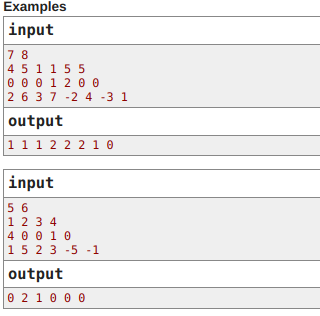
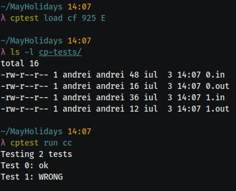

# cptest

This tool lets you check your competitive programming solutions easily,
by downloading example test cases locally and running your source against them.

Popular competitive programming websites are supported, such as Codeforces
and AtCoder.

If you wish, you can add custom tests manually, by following the convention
of the existing tests. These will also be run automatically.

The program checks your solution by comparing your output to the correct one.
This means that it is most useful for problems with a "fixed" output, because
it cannot detect if multiple correct answers exist. Interactive problems also
cannot be checked correctly.




## Table of Contents
* [Installation](#installation)
* [Usage](#usage)
* [Updating](#updating)
* [Uninstallation](#uninstallation) 

## Installation
To install the program, you'll need Python 3 and pip.
All you need to do is clone this repo and install with pip:
```bash
git clone https://github.com/pandrei7/cptest [YOUR_CHOICE_DIR]
pip install -e [YOUR_CHOICE_DIR]
```

For example, you could run the following commands:
```bash
git clone https://github.com/pandrei7/cptest ~/cptest
pip install -e ~/cptest
```

## Usage
You can download and run tests using the [`load`](#load) and [`run`](#run)
commands.

For example, using the program for a Codeforces problem will look like this:


Below is a more detailed description of the available commands.

### `load`
Downloads the testcases of a given problem.
You should specify the website and the problem identification data.

```bash
cptest load [site_id] [contest_id] [problem_id]
```

The tests are downloaded to a directory called "cp-tests" which you can
also access manually.

The following websites are supported:
| Website    | Site id | Example link                                      | Contest id | Problem id |
|:-----------|:-------:|:-------------------------------------------------:|:----------:|:----------:|
| AtCoder    | `at`    | atcoder.jp/contests/**abc165**/tasks/**abc165_d** | `abc165`   | `abc165_d` |
| Codeforces | `cf`    | codeforces.com/contest/**1370**/problem/**D**     | `1370`     | `D`        |

### `run`
Runs the given source against the downloaded tests.

```bash
cptest run [lang_id] [source(optional)]
```

The source field is not mandatory because the program can use default values.

If you're using a compiled language, you must first compile the program before
testing.

The following languages are supported:
| Language | Language ids       | Default source | Expected source |
|:---------|:------------------:|:---------------|:----------------|
| C        | `c`                | `main`         | an executable   |
| C++      | `cc`, `cpp`, `c++` | `main`         | an executable   |
| Java     | `java`             | `Main`         | the main class  |
| Python 3 | `python`, `py`     | `main.py`      | the main script |
| Rust     | `rust`, `rs`       | `main`         | an executable   |

### `clean`
Removes all files created by the program from the current directory.

### `update`
Updates the program to the latest version.

### `version`
Prints the current program version.

## Updating
To update, you can simply `git pull` the latest changes into your repository.

Another way to do this is to use the `update` command of the program itself.

## Uninstallation
You can uninstall the program with the command:
```bash
pip uninstall cptest
```

You might also have to remove the executable:
```bash
rm $(which cptest)
```

Then you can remove the repository itself.
